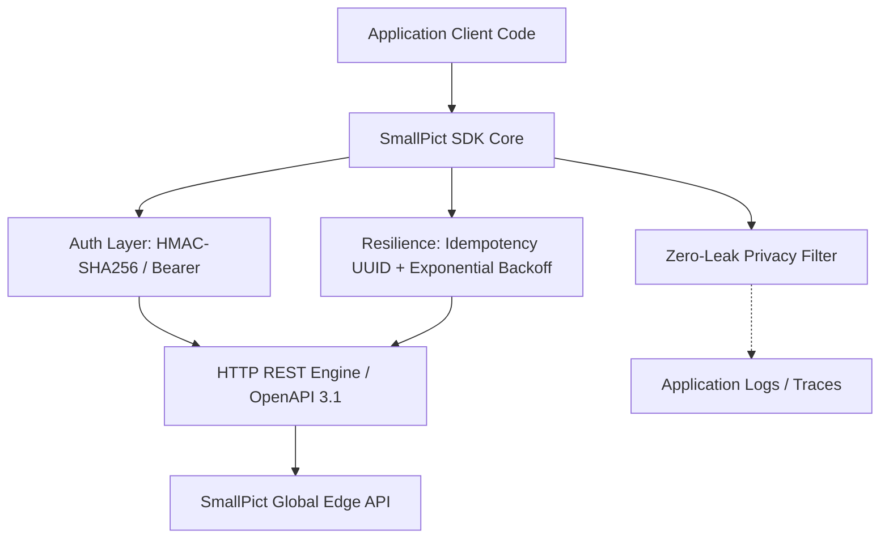

# SmallPict SDK Architectural Blueprint

This document details the common architectural invariants, design patterns, security guarantees, and fault-tolerance semantics implemented consistently across all 7 official SmallPict SDKs.

---

## 🏛️ Core Architectural Invariants

Every official SmallPict SDK conforms to the following standards:



### 1. Unified Method Interface (4 Core Methods)
Regardless of language naming conventions (camelCase vs snake_case vs PascalCase), every SDK implements the exact same 4 fundamental operations:

1. **`optimize(source, options)`**: Compresses and transcodes images (AVIF, WebP, JPEG, PNG, Auto).
2. **`getQuota()` / `get_quota()` / `GetQuota()`**: Retrieves real-time processing usage and CDN bandwidth metrics.
3. **`purgeCdn(urls, purgeType)`**: Flushes cached images across global Edge CDN points of presence.
4. **`validateKey()`**: Performs credential health check without side effects.
5. *Helper:* **`getJobStatus(jobId)`**: Polls asynchronous batch conversion jobs.

---

## 🛡️ Zero-Leak Credential Redaction

All SDKs implement strict regex-based credential masking to ensure customer API keys (`sp_live_...`, `sp_test_...`, `sp_sdk_...`) and HMAC secret keys (`sec_...`) never appear in plaintext in exception messages, string formatting (`toString()`, `__repr__`, `inspect`), or debugger stack traces.

```text
Input:  "Request failed with key sp_live_1234567890abcdef1234567890abcdef and secret sec_secret123"
Output: "Request failed with key sp_live_12...cdef and secret ***REDACTED***"
```

---

## 🔄 Resilient Request Pipeline & Idempotency

### Bounded Exponential Backoff with Jitter
When an API request encounters HTTP 429 (*Too Many Requests*) or transient HTTP 5xx (*500, 502, 503, 504*), all SDKs automatically retry up to `maxRetries` (default: 3) using exponential backoff:

\[
\text{delay} = \text{baseDelay} \times 2^{\text{attempt}-1} + \text{jitter}
\]

If the server provides a `Retry-After` header, the SDK prioritizes that duration.

### Automatic Idempotency Keys
Every mutating request (`POST`, `PATCH`, `DELETE`) automatically injects an `Idempotency-Key` header with a unique UUID v4. This guarantees that transient network drops or retries never result in duplicate optimization charges or duplicate database records on the backend.

---

## 🔀 Fallback Modes: High Availability vs Strict Throw

Every SDK supports the `fallbackMode` configuration option:

- **`throw` (Default):** Throws a typed `QuotaExceededException` / `QuotaExceededError` when storage or processing limits are reached.
- **`passthrough`:** On HTTP 402 (*Quota Exceeded*), rather than throwing an exception and breaking the user's application, the SDK gracefully returns the original uncompressed image buffer with `status: "completed"`, `savings_percentage: 0.0`, and `job_id: "fallback-passthrough"`.
